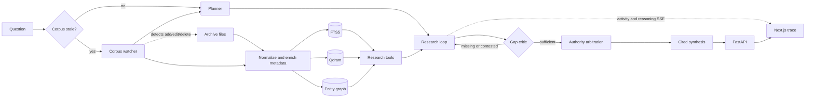
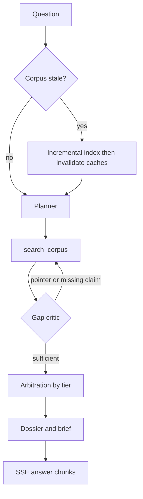

# Architecture

GestaltX is an iterative, gap-driven research system for the Ashen Era Archive. It does not treat the first retrieved passage as an answer. It plans a search, reads evidence, notices gaps and pointers, searches again, arbitrates conflicts by source authority, and then writes a cited brief a non-technical reader can follow.

The Next.js client is a presentation layer. Authority decisions, indexing, and synthesis stay in the backend.

## Layers

1. **Ingestion** normalizes Markdown, text, DOCX, PDF, and scanned sources into documents, sections, and chunks with source-tier metadata.
2. **Classification** assigns a family and tier from the corpus folder first, then filename keywords, then content headings. Unresolved files become mid-trust chronicles so they compete without overriding official sources.
3. **Indexing** combines SQLite FTS5 (default), an optional local Qdrant vector store, and a NetworkX entity graph.
4. **Corpus watcher** polls the archive folder, incrementally re-indexes adds/edits/deletes, and invalidates in-memory runtime caches. A question also triggers a staleness check so a just-dropped file is included.
5. **Planner** frames the entity and claim being researched and proposes the first queries.
6. **Tools** search the corpus, read only relevant sections, inspect entities, list sources, and compare claims.
7. **Gap critic** identifies missing evidence, contested values, and documentary pointers (“consult the Codex”).
8. **Research loop** reformulates the next query until evidence is sufficient or the iteration budget is exhausted. It streams activity and reasoning events while it works.
9. **Arbitration** ranks claims by source authority while preserving conflicts and near-name decoys.
10. **Answer engine** builds a document dossier, writes Answer / What the documents say / Why / How / Sources, calibrates confidence, and optionally lets a local LLM polish only the Answer and Why sections after a voice check.

## Runtime path

A question hits FastAPI (`POST /api/ask` or `GET /api/ask/stream`). `Runtime.research_loop()` first calls `refresh_corpus()`. If the watcher finds new files, it parses and chunks only those files, replaces their FTS rows, merges JSONL, rebuilds the entity graph, bumps `corpus_manifest.json`, and drops cached searcher/graph/tools. The loop then emits an activity status such as “Noticed 1 new document…”, plans, searches, judges, and streams answer sections.

While the UI is idle it polls `GET /api/corpus` every four seconds and shows an archive-updated chip when the manifest version increases.

## Answer shape

The finder sees five sections, not a raw model dump:

- **Answer** — the fact, with the winning document named by friendly title and a `[n]` cite.
- **What the documents say** — each consulted work, its kind (official codex, community wiki, chronicle, loose paper), and what it claimed.
- **Why this is the answer** — rival years attributed to named documents, and why the winner stands.
- **How this answer was found** — the research path in ordinary language.
- **Sources** — dossier rows with locator and role (settles, disputes, pointer, mentions).

Voice rules are enforced in `gestaltx.agent.voice`: no we/I, no file paths in prose, no “you can trust” filler. LLM output that fails the check is discarded and the heuristic brief is used.

## Diagrams

Source files also live under [docs/diagrams/](diagrams/README.md).

### System flow

### Research loop

### More

| Diagram | What it shows |
| --- | --- |
| [architecture.mmd](diagrams/architecture.mmd) | Client, API, stores |
| [research_loop.mmd](diagrams/research_loop.mmd) | Full plan → search → critique loop |
| [answer_engine.mmd](diagrams/answer_engine.mmd) | Dossier, voice, optional LLM polish |
| [corpus_refresh.mmd](diagrams/corpus_refresh.mmd) | Incremental archive refresh |
| [document_classification.mmd](diagrams/document_classification.mmd) | Folder, filename, content, default |
| [live_answer_stream.mmd](diagrams/live_answer_stream.mmd) | SSE sequence and idle poll |
